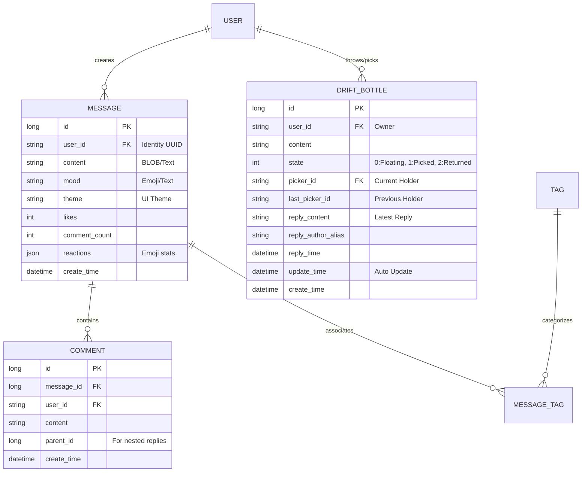

# 数据库参考手册 (Database Reference)

## 1. 实体关系图 (ER Diagram)

## 2. 核心表结构说明

### 2.1 drift_bottle (漂流瓶)
存储跨海洋的异步交互数据。

| 字段 | 类型 | 说明 |
| :--- | :--- | :--- |
| id | BIGINT | 主键，自增 |
| user_id | VARCHAR(36) | 瓶子所有者的 UUID |
| state | TINYINT | 状态 (0: 漂流中, 1: 被捞起, 2: 已归还) |
| picker_id | VARCHAR(36) | 当前捞起者的 UUID |
| update_time | DATETIME | 自动更新时间 (ON UPDATE CURRENT_TIMESTAMP) |
| create_time | DATETIME | 投掷时间 |

### 2.2 message (树洞留言)
匿名社区的核心数据载体。

| 字段 | 类型 | 说明 |
| :--- | :--- | :--- |
| user_id | VARCHAR(36) | 发布者 UUID |
| content | TEXT | 留言正文 |
| mood | VARCHAR(20) | 发布时的心情标识 |
| reactions | JSON | 动态表情点赞统计 |

## 3. 设计哲学
1. **去中心化身份**：不存储用户手机号、邮箱，仅通过客户端生成的 UUID (`user_id`) 进行逻辑绑定。
2. **时序优先**：所有核心表均包含 `create_time` 索引，确保“广场”和“回响中心”的查询性能。
3. **松耦合关联**：使用逻辑外键，避免数据库物理约束对大规模数据迁移的影响。
